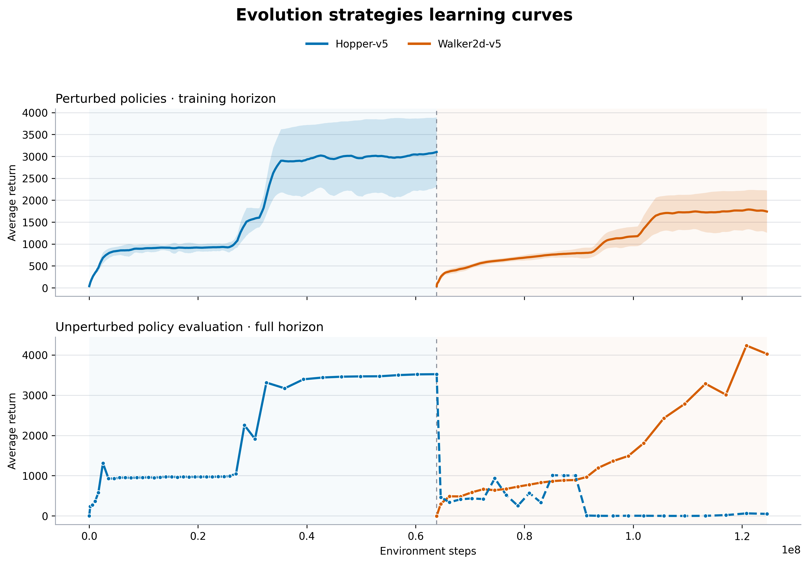
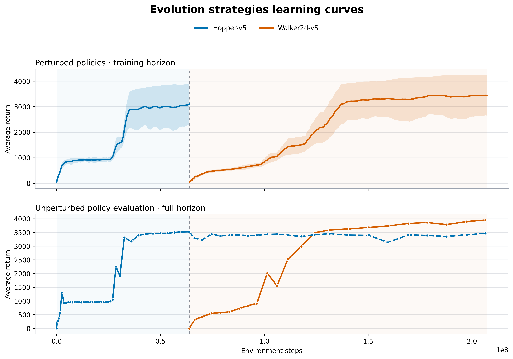
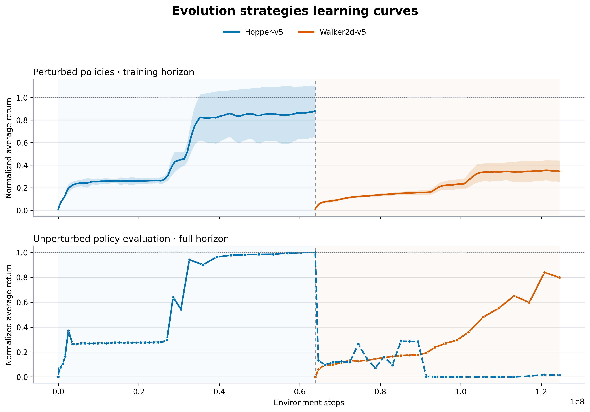
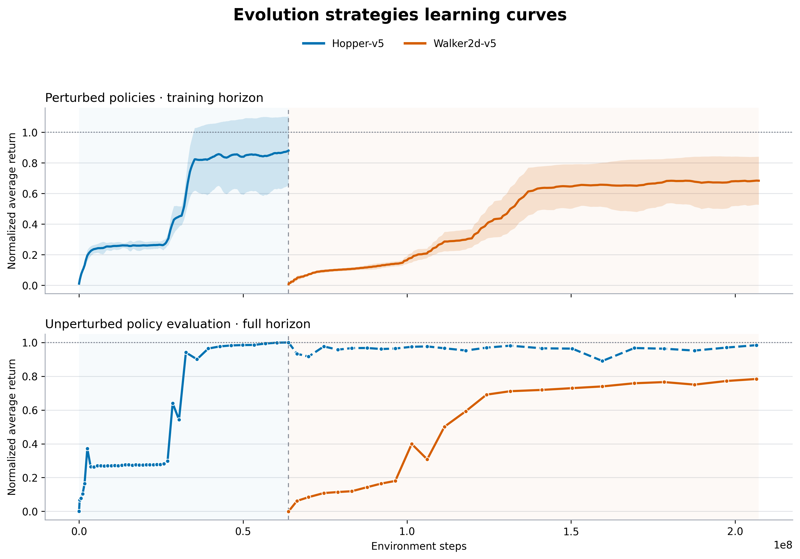

# Distributed Continual ES

A distributed implementation of evolution strategies (ES) for continuous-control reinforcement learning and continual learning. It uses antithetic perturbations, Ray rollout workers, rank-based fitness shaping, and Adam updates, following the approach of [Salimans et al. (2017)](https://arxiv.org/abs/1703.03864).

The project supports single-task and multitask training, sequential tasks loaded from checkpoints, replay over previous tasks, adaptive rollout horizons, discretized actions, and running observation normalization.

## Installation

Python 3.11 or newer is required. Create the Conda environment:

```bash
conda env create -f environment.yml
conda activate es
```

Alternatively, install the package in an existing environment:

```bash
pip install -e ".[plot]"
```

## Usage

Train a single task:

```bash
es-train --env Hopper-v5 --num-workers 12 --num-directions 384 \
    --normalize-observations true --action-bins 10
```

Train multiple tasks jointly by passing multiple environments, or continue on a new task from a checkpoint:

```bash
es-train --env Hopper-v5 Walker2d-v5

es-train --env Walker2d-v5 --checkpoint chkpts/hopper.pth \
    --replay-directions 16 --replay-interval 10
```

Evaluate a checkpoint and plot its learning curves:

```bash
es-evaluate --checkpoint chkpts/policy.pth --task Hopper-v5 --episodes 10

es-plot curves logs/csv/run.csv --tasks Hopper-v5 \
    --series both --x-axis steps --smooth 10 --output plots/hopper.png
```

For a multi-node Slurm job, the launcher forwards all remaining arguments to the training CLI:

```bash
sbatch run_ray_cluster.sh --env Hopper-v5 --num-workers 112 \
    --num-directions 384
```

Run `es-train --help`, `es-evaluate --help`, or `es-plot --help` for all options. Training writes CSV logs to `logs/csv/` and checkpoints to `chkpts/`.

## Example results

| No replay | Replay every three generations |
|:--:|:--:|
|  |  |
|  |  |

## Tests

```bash
python -m unittest discover -s tests -v
```
